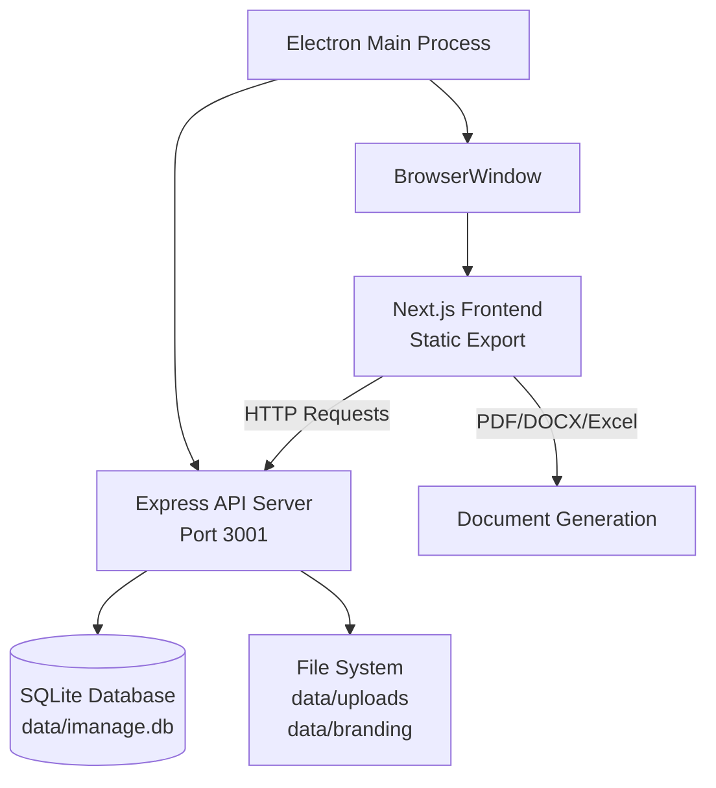
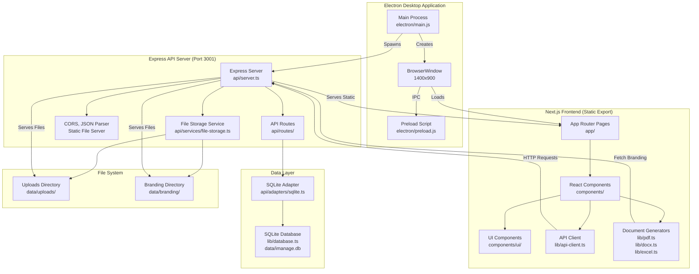
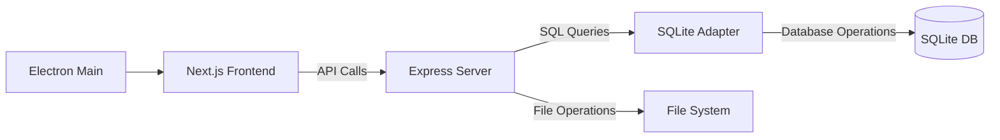
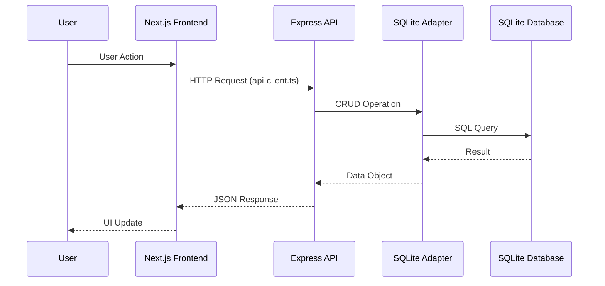
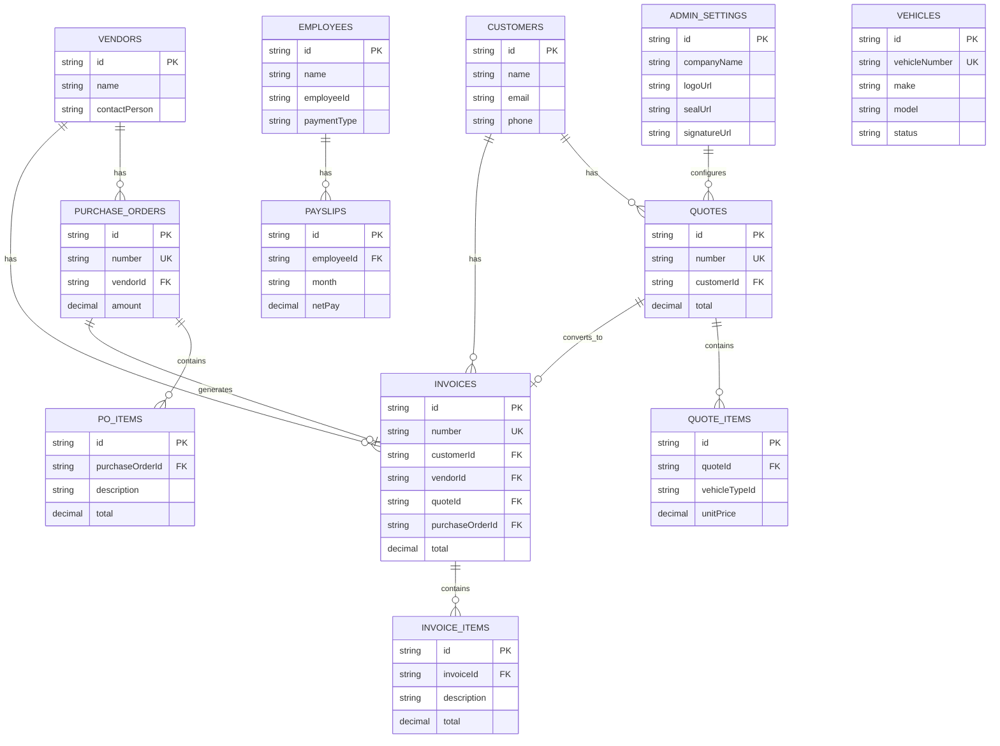
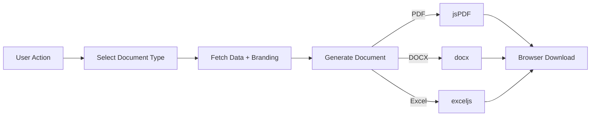
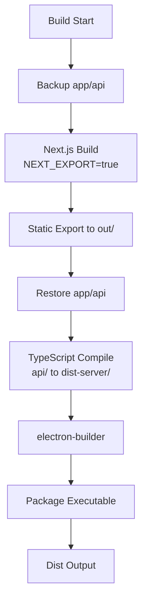

# iManage CRM Architecture

## System Overview

iManage is a desktop Car Rental CRM system built with Electron, Next.js, and Express. It provides customer management, vehicle tracking, quote/invoice generation, purchase order management, and employee payroll functionality.

**Key Modules:**
- Core: Customers, Vendors, Employees, Vehicles
- Documents: Quotes, Purchase Orders, Invoices, Payslips
- Financial: Vehicle Transactions, Expense Categories, Vehicle Profitability, Dashboard Metrics
- System: Admin Settings, File Uploads, Dashboard

## Complete Application Architecture

## Application Workflows

```mermaid
graph TD
    subgraph QuoteWorkflow["Quote Workflow"]
        Q1[Create Quote] --> Q2[Select Customer]
        Q2 --> Q3[Add Vehicle Items]
        Q3 --> Q4[Calculate Totals]
        Q4 --> Q5[Save Quote]
        Q5 --> Q6{Export?}
        Q6 -->|PDF| Q7[Generate PDF]
        Q6 -->|DOCX| Q8[Generate DOCX]
        Q6 -->|Excel| Q9[Generate Excel]
        Q7 --> Q10[Download]
        Q8 --> Q10
        Q9 --> Q10
        Q5 --> Q11{Convert?}
        Q11 -->|Yes| I1
    end
    
    subgraph InvoiceWorkflow["Invoice Workflow"]
        I1[Create Invoice] --> I2{Source?}
        I2 -->|From Quote| I3[Load Quote Data]
        I2 -->|From PO| I4[Load PO Data]
        I2 -->|Manual| I5[Enter Details]
        I3 --> I6[Add Invoice Items]
        I4 --> I6
        I5 --> I6
        I6 --> I7[Calculate Totals]
        I7 --> I8[Set Payment Status]
        I8 --> I9[Save Invoice]
        I9 --> I10{Export?}
        I10 -->|PDF| I11[Generate PDF]
        I10 -->|DOCX| I12[Generate DOCX]
        I10 -->|Excel| I13[Generate Excel]
        I11 --> I14[Download]
        I12 --> I14
        I13 --> I14
    end
    
    subgraph PurchaseOrderWorkflow["Purchase Order Workflow"]
        P1[Create PO] --> P2[Select Vendor]
        P2 --> P3[Add Items]
        P3 --> P4[Calculate Amount]
        P4 --> P5[Set Status]
        P5 --> P6[Save PO]
        P6 --> P7{Export?}
        P7 -->|PDF| P8[Generate PDF]
        P8 --> P9[Download]
        P6 --> P10{Convert?}
        P10 -->|Yes| I1
    end
    
    subgraph PayrollWorkflow["Payroll Workflow"]
        Pay1[Salary Calculation] --> Pay2[Select Employee]
        Pay2 --> Pay3[Load Base Salary]
        Pay3 --> Pay4[Add Overtime Hours]
        Pay4 --> Pay5[Calculate Overtime Pay]
        Pay5 --> Pay6[Apply Deductions]
        Pay6 --> Pay7[Calculate Net Pay]
        Pay7 --> Pay8[Create Payslip]
        Pay8 --> Pay9[Set Status]
        Pay9 --> Pay10[Save Payslip]
    end
    
    subgraph FileUploadWorkflow["File Upload Workflow"]
        F1[Upload File] --> F2{File Type?}
        F2 -->|Branding| F3[Save to data/branding/]
        F2 -->|Document| F4[Save to data/uploads/]
        F3 --> F5[Return Fixed Path]
        F4 --> F6[Return UUID Path]
        F5 --> F7[Store in Admin Settings]
        F6 --> F8[Store in Entity]
    end
    
    subgraph DocumentGenerationWorkflow["Document Generation Workflow"]
        D1[User Requests Export] --> D2[Fetch Entity Data]
        D2 --> D3[Fetch Admin Settings]
        D3 --> D4[Fetch Branding Images]
        D4 --> D5{Format?}
        D5 -->|PDF| D6[Render HTML to Canvas]
        D6 --> D7[Convert Canvas to PDF]
        D5 -->|DOCX| D8[Build DOCX Document]
        D5 -->|Excel| D9[Build Excel Workbook]
        D7 --> D10[Create Blob]
        D8 --> D10
        D9 --> D10
        D10 --> D11[Trigger Browser Download]
    end
```

## Technology Stack

**Core:**
- Next.js 16 (React 18, TypeScript)
- Express 5 (Node.js)
- Electron 39
- SQLite (better-sqlite3)

**UI:**
- Tailwind CSS, Radix UI, shadcn/ui

**Document Generation:**
- jsPDF, html2canvas (PDF)
- docx (DOCX)
- exceljs (Excel)

## Architecture Layers

### Electron Main Process
**File:** `electron/main.js`

Manages application lifecycle, spawns Express API server, and creates BrowserWindow. Handles both development (tsx) and production (compiled JS) server execution.

### Next.js Frontend
**Files:** `app/`, `components/`

Static export for Electron. Uses App Router with client-side routing. Components organized in `components/` with UI primitives in `components/ui/`.

### Express API Server
**File:** `api/server.ts`

RESTful API on port 3001. Serves static frontend files and handles all data operations. Routes organized by entity in `api/routes/`.

### Database Layer
**Files:** `lib/database.ts`, `api/adapters/sqlite.ts`

SQLite database with adapter pattern. Schema initialization and migrations handled in `lib/database.ts`. CRUD operations via adapters in `api/adapters/sqlite.ts`.

## Data Flow

**File Upload Flow:**
1. Frontend uploads via FormData to `/api/uploads`
2. Express saves to `data/uploads/{type}/` or `data/branding/`
3. Returns relative path stored in database

**Document Generation Flow:**
1. Frontend calls PDF/DOCX/Excel renderer (`lib/pdf.ts`, `lib/docx.ts`, `lib/excel.ts`)
2. Fetches branding images from API
3. Generates document blob client-side
4. Triggers browser download

## Module Structure

### Core Modules
- **Customers:** `api/routes/customers.ts`, `app/customers/page.tsx`
- **Vendors:** `api/routes/vendors.ts`, `app/vendors/page.tsx`
- **Employees:** `api/routes/employees.ts`, `app/employees/page.tsx`
- **Vehicles:** `api/routes/vehicles.ts`, `app/vehicles/page.tsx`

### Document Modules
- **Quotes:** `api/routes/quotes.ts`, `app/quotes/`, `app/quotations/`
- **Purchase Orders:** `api/routes/purchase-orders.ts`, `app/purchase-orders/`
- **Invoices:** `api/routes/invoices.ts`, `app/invoices/`
- **Payslips:** `api/routes/payslips.ts`, `app/payslips/`

### Financial Modules
- **Vehicle Transactions:** `api/routes/vehicle-transactions.ts`, `app/vehicle-finances/[vehicleId]/page.tsx`
- **Expense Categories:** `api/routes/expense-categories.ts`, `app/finances/expense-categories/page.tsx`
- **Vehicle Profitability:** `app/vehicle-profitability/page.tsx`
- **Vehicle Finances Dashboard:** `app/vehicle-finances/page.tsx`, `app/api/[...route]/route.ts`

### System Modules
- **Admin:** `api/routes/admin.ts`, `app/admin/page.tsx`
- **Uploads:** `api/routes/uploads.ts`, `api/services/file-storage.ts`
- **Dashboard:** `app/dashboard/page.tsx`

## Database Schema

**Key Relationships:**
- Quotes → Customers (many-to-one)
- Invoices → Customers/Vendors/Quotes/POs (optional foreign keys)
- Purchase Orders → Vendors (many-to-one)
- Payslips → Employees (many-to-one)
- Quote Items, PO Items, Invoice Items (one-to-many with parent)

## API Structure

**Base URL:** `http://localhost:3001/api`

| Endpoint | Method | Description |
|----------|--------|-------------|
| `/customers` | GET, POST | List/create customers |
| `/customers/:id` | GET, PUT, DELETE | Customer operations |
| `/vendors` | GET, POST | List/create vendors |
| `/vendors/:id` | GET, PUT, DELETE | Vendor operations |
| `/employees` | GET, POST | List/create employees |
| `/employees/:id` | GET, PUT, DELETE | Employee operations |
| `/vehicles` | GET, POST | List/create vehicles |
| `/vehicles/:id` | GET, PUT, DELETE | Vehicle operations |
| `/quotes` | GET, POST | List/create quotes |
| `/quotes/:id` | GET, PUT, DELETE | Quote operations |
| `/purchase-orders` | GET, POST | List/create POs |
| `/purchase-orders/:id` | GET, PUT, DELETE | PO operations |
| `/invoices` | GET, POST | List/create invoices |
| `/invoices/:id` | GET, PUT, DELETE | Invoice operations |
| `/payslips` | GET, POST | List/create payslips |
| `/payslips/:id` | GET, PUT, DELETE | Payslip operations |
| `/admin/settings` | GET, POST | Admin settings |
| `/uploads` | POST | File uploads |
| `/uploads/branding/:type` | GET | Branding file serving |

**Request/Response Pattern:**
- GET: Returns array or single object
- POST: Creates new entity, returns created object
- PUT: Updates entity, returns updated object
- DELETE: Deletes entity, returns 204

## Frontend Structure

**Pages:** `app/` directory (Next.js App Router)
- `dashboard/` - Main dashboard
- `customers/`, `vendors/`, `employees/`, `vehicles/` - Core entity pages
- `quotes/`, `quotations/` - Quote management
- `purchase-orders/` - PO management
- `invoices/` - Invoice management
- `payslips/`, `salary-calculation/` - Payroll
- `admin/` - Settings
- `reports/` - Reports

**Components:** `components/`
- `ui/` - shadcn/ui primitives (58 components)
- `dashboard.tsx`, `sidebar.tsx`, `navigation.tsx` - Layout
- `invoice-generator.tsx`, `billing-tracker.tsx` - Feature components

**API Client:** `lib/api-client.ts` - Centralized API calls

## Document Generation

**Files:** `lib/pdf.ts`, `lib/docx.ts`, `lib/excel.ts`

Client-side document generation:
- **PDF:** html2canvas + jsPDF (renders HTML to canvas, converts to PDF)
- **DOCX:** docx library (programmatic document creation)
- **Excel:** exceljs (workbook creation with formulas)

All generators fetch branding images (logo, seal, signature) from API and embed in documents.

## Build Process

**Key Steps:**
1. Backup `app/api` (Next.js static export doesn't support API routes)
2. Build Next.js with static export → `out/`
3. Compile TypeScript API → `dist-server/`
4. Package with electron-builder → `dist/`

**Scripts:**
- `npm run build:electron` - Full Electron build
- `npm run build:server` - Compile API only
- `npm run dev` - Development (concurrently runs API + Next.js)

